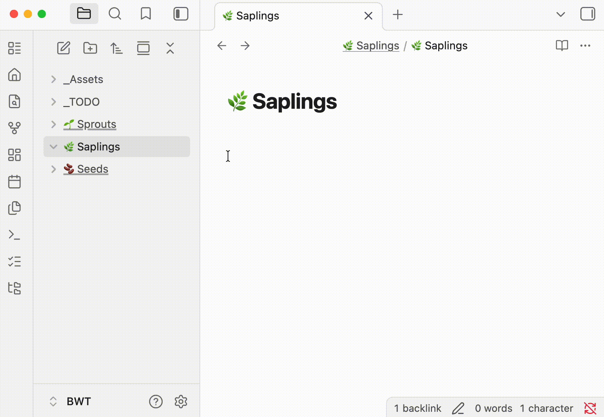

# Folder Children

Sync each folder's direct children into a collapsible **Children** section on its folder note.

**Requires [Folder Notes](https://github.com/LostPaul/obsidian-folder-notes).** Install Folder Notes first.



## Install

[Open in Obsidian](https://obsidian.md/plugins?id=folder-children) or search for **Folder Children** under **Settings → Community plugins → Browse**.

## Usage

1. Run **Sync folder children lists** (command palette or folder-tree ribbon icon).
2. Review the preview.
3. Click **Approve**.

For each folder with a folder note, direct child notes and subfolders are listed alphabetically in a callout:

```markdown
> [!abstract]- Children
> - [[Note]]
> - [[Subfolder/Subfolder]]
```

Subfolders link to their folder note when one exists. Folders without a folder note are skipped. Hidden files, `.obsidian`, and the folder note itself are never listed.

## Folder notes

Parent notes are resolved the same way as [Folder Notes](https://github.com/LostPaul/obsidian-folder-notes):

1. `Folder/Folder.md` — inside the folder
2. `Folder.md` — sibling of the folder

## Development

```bash
npm install
npm run build
```

## License

MIT — see [LICENSE](LICENSE).
